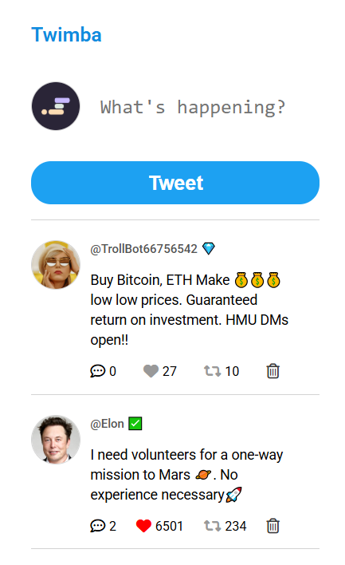

# 🐦 Twimba

Twimba is a simple Twitter (X) clone built with vanilla JavaScript that allows users to post tweets, like, retweet, and delete tweets — with data persisted in the browser using localStorage.

---

## 🚀 Live Demo

[View the deployed site here](https://twimba-golden.netlify.app/)

---

## 📸 Project Screenshot



---

## 🚀 Features

- 📝 Create new tweets
- ❤️ Like and unlike tweets
- 🔁 Retweet and undo retweets
- 💬 View replies to tweets
- 🗑️ Delete tweets
- 💾 Persistent data using `localStorage`
- 🎨 Clean and responsive UI

---

## 🛠️ Tech Stack

- HTML5
- CSS3
- JavaScript (ES6 Modules)
- UUID (for unique tweet IDs)
- Font Awesome (icons)

---

## ⚙️ How It Works

- Tweets are stored in an array (`tweetsData`)
- A local copy (`myTweetsData`) is used to manage state
- All interactions (like, retweet, delete, etc.) update this state
- Changes are saved to `localStorage`
- The UI is re-rendered dynamically after every update

---

## ▶️ Getting Started

1. Clone the repository:

```bash
git clone https://github.com/goldenokeama/twimba.git
```

2. Navigate into the project folder:

```bash
cd twimba
```

3. Open `index.html` in your browser

---

## 💡 Key Concepts Practiced

- DOM manipulation
- Event delegation
- State management in vanilla JavaScript
- Working with `localStorage`
- Modular JavaScript (ES Modules)
- Dynamic rendering
